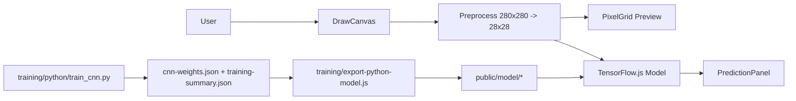
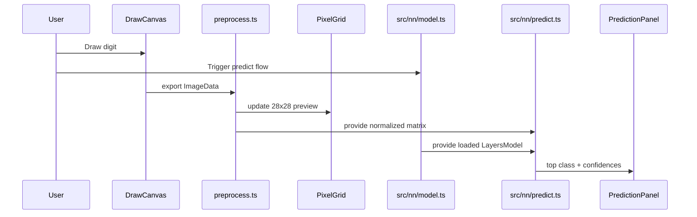
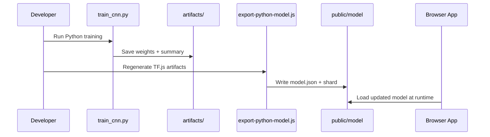

# CNN Visualizer - System Architecture

## 1. Architecture Objective

The current architecture is designed around two concrete concerns:

1. run digit inference entirely in the browser,
2. maintain a separate local training pipeline that can regenerate the browser model artifacts safely.

This keeps the runtime simple while still allowing the model to evolve.

## 2. Architecture Boundaries

CNN Visualizer currently has three practical boundaries:

- Browser runtime:
  - drawing,
  - preprocessing,
  - TensorFlow.js inference,
  - prediction UI.
- Static model assets:
  - `public/model/model.json`,
  - `public/model/group1-shard1of1.bin`.
- Local training workspace:
  - JS experiments in `training/`,
  - Python/Keras training in `training/python/`,
  - export back into `public/model/`.

Cloudflare deployment is the next delivery boundary, but it is not implemented yet in the repo.

## 3. High-Level Architecture Diagram

## 4. Browser Module Map

Current browser runtime modules:

- `src/main.ts`
  - bootstraps the app,
  - wires drawing, preprocessing, prediction, and UI state.
- `src/canvas/DrawCanvas.ts`
  - pointer input,
  - freehand drawing,
  - clear/export behavior.
- `src/canvas/preprocess.ts`
  - grayscale conversion,
  - light dilation,
  - bounding-box extraction,
  - centering and resize to `28x28`.
- `src/canvas/PixelGrid.ts`
  - visual preview of the processed input matrix.
- `src/nn/model.ts`
  - model loading,
  - model promise caching,
  - warmup.
- `src/nn/predict.ts`
  - tensor construction,
  - prediction execution,
  - confidence ranking.
- `src/ui/PredictionPanel.ts`
  - top-class UI,
  - confidence bar rendering,
  - reset behavior.

## 5. Training and Export Module Map

Current training/export modules:

- `training/train-baseline.js`
  - linear baseline experiment.
- `training/train-cnn.js`
  - JS-based CNN experiment path.
- `training/model-factory.js`
  - shared model definitions.
- `training/tfjs-export.js`
  - writes TF.js `model.json` and shard binaries.
- `training/export-python-model.js`
  - rebuilds browser artifacts from Python-exported weights.
- `training/python/train_cnn.py`
  - main Keras training script for `cnn-visualizer-cnn-v2`.
- `training/python/artifacts/training-summary.json`
  - stores training metrics and confusion data.
- `training/python/artifacts/cnn-weights.json`
  - serialized weights for TF.js export.

## 6. Runtime Sequence

## 7. Training / Export Sequence

## 8. Design Decisions

### 8.1 Browser-Only Inference

Inference stays in the browser to keep:

- demos simple,
- asset delivery static,
- prediction latency local,
- deployment backend-free.

### 8.2 Separate Training Workspace

Training is intentionally not part of the frontend runtime.

This separation keeps:

- the browser bundle small,
- the frontend code focused,
- model iteration faster,
- retraining workflows reproducible.

### 8.3 Static Artifact Contract

The browser does not know how the model was trained. It only depends on a stable artifact contract under `public/model/`.

That allows the training implementation to evolve without rewriting the UI every time.

## 9. Architectural Risks and Mitigations

- Risk: browser preprocess drifts away from training assumptions.
  - Mitigation: keep preprocessing docs and training/export summaries aligned.
- Risk: exported weights do not match the browser topology.
  - Mitigation: regenerate artifacts through the shared export scripts.
- Risk: static hosting path breaks `/model/model.json`.
  - Mitigation: keep hosting aligned with root-served static paths; validate `dist/model`.
- Risk: deployment docs drift from the actual hosting target.
  - Mitigation: keep deployment docs focused on Cloudflare Pages only.

## 10. Current Architecture Summary

The current system is best described as:

1. a browser inference app,
2. backed by static TF.js model assets,
3. fed by a separate local training/export pipeline.

That is the architecture the repo implements today. Advanced visualization and deployment automation remain follow-on phases, not current runtime modules.
