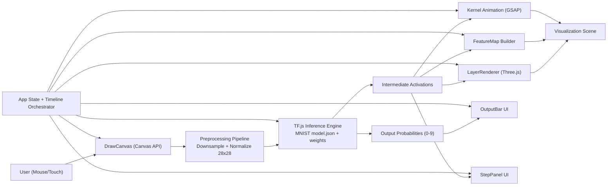
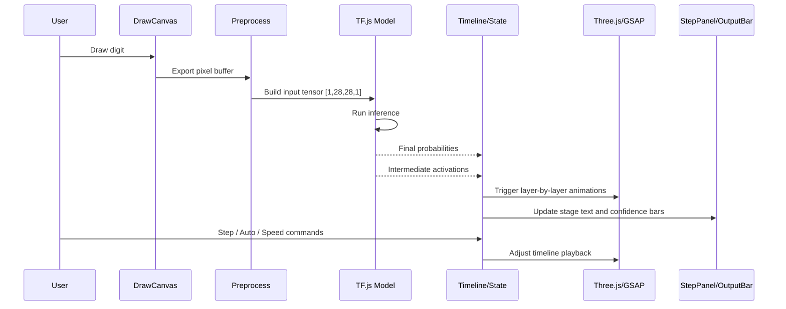

# CNN Visualizer - System Architecture

## 1. Architecture Objective

The system architecture is designed to make CNN inference transparent, interactive, and reproducible in a fully client-side environment.

The architecture must satisfy four constraints:

1. Run entirely in the browser with no backend runtime.
2. Keep rendering and ML responsibilities decoupled.
3. Support step-by-step visualization synchronized with model execution.
4. Remain modular enough to evolve from educational prototype to production-ready static app.

## 2. Architecture Style

CNN Visualizer uses a **modular client-side architecture** with a **single runtime boundary** (the browser).

This is a layered decomposition:

- Input layer: user drawing and pixel normalization.
- ML layer: TensorFlow.js model loading, inference, and intermediate activations.
- Visualization layer: 2D/3D rendering and animation orchestration.
- UI layer: user controls, step panel, and prediction output.
- Orchestration layer: shared state and processing lifecycle coordination.

The implementation is framework-light (Vanilla TypeScript + Vite) to preserve performance and control over render timing.

## 3. High-Level Architecture Diagram

## 4. Module Map (Code-Level Ownership)

Expected project structure and responsibility boundaries:

- `src/main.ts`
  - bootstrap sequence,
  - dependency wiring,
  - global lifecycle startup.
- `src/canvas/DrawCanvas.ts`
  - pointer events,
  - drawing buffer,
  - canvas reset and capture.
- `src/canvas/PixelGrid.ts`
  - 28x28 input visualization.
- `src/nn/model.ts`
  - model loading with `tf.loadLayersModel`,
  - inference execution,
  - activation extraction model (`tf.model` with layer outputs).
- `src/nn/layers.ts`
  - layer metadata for rendering and explanations.
- `src/viz/LayerRenderer.ts`
  - 3D layer geometry and activation coloring.
- `src/viz/KernelAnim.ts`
  - convolution kernel traversal animation.
- `src/viz/FeatureMap.ts`
  - progressive feature-map generation logic.
- `src/ui/StepPanel.ts`
  - stage explanation and progression controls.
- `src/ui/OutputBar.ts`
  - confidence bars and winning class emphasis.
- `src/shaders/activation.vert`
  - vertex behavior for activation effects.
- `src/shaders/activation.frag`
  - activation value to color/glow mapping.

## 5. Runtime Sequence (Inference + Visualization)

## 6. Why This Architecture

### 6.1 Full Browser Execution

The project goal explicitly requires no backend dependency. Running all inference and visualization in-browser guarantees:

- zero network round-trip for prediction loops,
- deterministic local demos in classrooms/workshops,
- simple deployment as static assets.

### 6.2 Separation of Concerns

Visualization and ML processing are independent concerns with different change rates:

- ML logic evolves around model APIs and tensor transformations.
- Visualization evolves around rendering style, animation, and UX.

Decoupling these layers prevents rendering changes from breaking inference logic and vice versa.

### 6.3 Synchronized Educational Flow

The app is an explanatory tool, not only a classifier. The orchestrator-centric runtime allows:

- deterministic step-by-step progression,
- replayable transitions,
- strict synchronization between layer activation, kernel movement, and textual explanation.

### 6.4 Performance and Control

Using Vanilla TypeScript with Vite (instead of a heavy UI framework) reduces runtime overhead and gives direct control of:

- animation frame scheduling,
- memory lifecycle for tensors and GPU resources,
- render timing coordination between Canvas, Three.js, and GSAP.

### 6.5 Deployment Simplicity

A static, client-only architecture maps directly to GitHub Pages + GitHub Actions:

- no server provisioning,
- low operational cost,
- straightforward CI/CD path.

## 7. Data Contracts Between Layers

Minimum interface contracts to keep modules decoupled:

- `DrawCanvas -> Preprocess`
  - Input: raw pixel RGBA buffer.
  - Output: normalized grayscale matrix `number[28][28]`.
- `Preprocess -> NN`
  - Input: normalized matrix.
  - Output: tensor shaped `[1, 28, 28, 1]`.
- `NN -> Visualization`
  - Input: per-layer activation tensors converted to typed arrays.
  - Output: render payload with layer id, dimensions, values, and normalized ranges.
- `NN -> UI`
  - Input: probability vector length 10.
  - Output: ranked classes and confidence percentages.
- `UI Controls -> Orchestrator`
  - Commands: `step`, `play`, `pause`, `setSpeed`, `reset`.

## 8. Architectural Risks and Mitigations

- Risk: browser memory growth from repeated tensor allocations.
  - Mitigation: enforce `tf.tidy()` boundaries and explicit tensor disposal.
- Risk: animation desynchronization across modules.
  - Mitigation: single timeline authority in orchestrator.
- Risk: low-end device performance drops.
  - Mitigation: adaptive quality settings and capped frame complexity.
- Risk: model asset path issues in static deployment.
  - Mitigation: deterministic asset paths under `public/model/` and CI validation.

## 9. Architecture Decision Summary

This architecture is used because it is the best fit for the product’s educational mission:

1. It makes CNN internals observable in real time.
2. It preserves clear technical boundaries for maintainability.
3. It supports deterministic, synchronized visual storytelling.
4. It deploys as a low-friction static web application.

The result is a technically robust system that remains simple to run, reason about, and extend.
