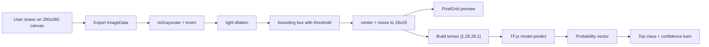

# CNN Visualizer - Current Inference Pipeline

## 1. Pipeline Objective

This document defines the inference pipeline that is implemented today in the browser runtime.

Its job is to turn a freehand drawing into:

- a normalized `28x28` input matrix,
- a TensorFlow.js model prediction,
- a ranked confidence output for digits `0-9`.

## 2. Pipeline Overview



## 3. Input Contract

### Source

- Drawing canvas size: `280x280`
- Brush color: black stroke on a white/transparent background
- Capture format: browser `ImageData`

### Preprocess Output

- Type: `number[28][28]`
- Range: `[0, 1]`
- Convention:
  - `0` is background-like,
  - `1` is strong ink.

## 4. Current Preprocessing Steps

The implemented preprocessing flow in `src/canvas/preprocess.ts` is:

1. Read RGBA pixels from the canvas.
2. Composite transparent pixels onto white.
3. Convert to grayscale intensity.
4. Invert intensity so darker stroke becomes larger signal.
5. Apply light dilation to reconnect thin or slightly broken strokes.
6. Detect the ink bounding box using an explicit threshold.
7. Place the detected content in a square workspace.
8. Resize to an inner `20x20` region.
9. Center that region inside the final `28x28` matrix.
10. Clamp values to `[0,1]`.

### Important Constants

- Output size: `28x28`
- Inner content size: `20x20`
- Ink threshold: `0.2`

### Current Empty-Canvas Behavior

If no ink is detected, preprocessing returns an all-zero `28x28` matrix.

The current app does not yet expose a dedicated "no input" UX state; it will still allow prediction against that zero matrix.

## 5. Reference Pipeline Shape

```ts
const imageData = drawCanvas.exportImageData();
const matrix28 = preprocessTo28x28(imageData);
pixelGrid.update(matrix28);
const result = await predictDigit(model, matrix28);
```

## 6. Tensor Construction

The current prediction path flattens the `28x28` matrix into a `Float32Array` and builds:

- shape: `[1, 28, 28, 1]`
- dtype: `float32`

Reference pattern:

```ts
const input = tf.tensor4d(flatInput, [1, 28, 28, 1], 'float32');
```

## 7. Model Execution

### Load Path

The model is loaded from:

```ts
tf.loadLayersModel('/model/model.json')
```

### Runtime Behavior

- The model promise is cached after the first successful load.
- A warmup pass with `tf.zeros([1, 28, 28, 1])` runs after loading.
- Prediction is executed on the loaded `LayersModel`.

### Probability Handling

The exported model currently ends with `softmax`, so output is expected to already be probabilities.

Even so, the prediction code checks whether the output looks like a probability vector and applies `tf.softmax()` only if necessary.

## 8. Output Contract

Current output shape for the UI:

```ts
type PredictionResult = {
  confidences: number[];
  topClass: number;
  topConfidence: number;
  ranking: Array<{ digit: number; confidence: number }>;
};
```

Rules:

- `confidences.length` must be `10`
- `topClass` is the highest-confidence digit
- `ranking` is sorted descending by confidence

## 9. Memory and Performance Rules

Current runtime safeguards:

1. Temporary tensors are wrapped in `tf.tidy()` during prediction.
2. Warmup tensors are disposed immediately after model load.
3. The final output tensor is disposed after its values are copied to JS.
4. The model itself is loaded once and reused.

## 10. Alignment With Training

The browser pipeline must stay aligned with the artifact generation flow from:

- `training/train-cnn.js`
- `training/python/train_cnn.py`
- `training/export-python-model.js`

The most important compatibility points are:

1. intensity convention,
2. spatial shape `28x28x1`,
3. centered digit placement,
4. resilience to stroke thickness and small gaps.

## 11. Current Limitations

The current browser pipeline does not yet include:

- intermediate activation extraction for the UI,
- layer-by-layer visualization payloads,
- a dedicated no-input state,
- automated browser-side validation of model asset integrity.

Those belong to future phases, not the current runtime contract.

## 12. Acceptance Checklist

The current inference pipeline is behaving correctly when:

1. repeated identical input produces the same `28x28` matrix,
2. the model loads from `/model/model.json`,
3. a valid prediction returns `10` class confidences,
4. the top-class UI updates after each predict action,
5. repeated draw/predict/clear cycles do not visibly degrade the app.
