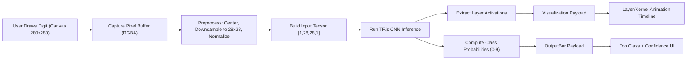

# CNN Visualizer - CNN Inference Pipeline

## 1. Pipeline Objective

This document defines the end-to-end inference pipeline for CNN Visualizer V1: from user-drawn pixels to final digit prediction and intermediate activations used by the visualization engine.

The pipeline must be:

1. Deterministic for identical input.
2. Fully client-side (TensorFlow.js in browser).
3. Synchronized with UI/animation playback.
4. Memory-safe under repeated inference cycles.

## 2. Pipeline Overview



## 3. Input Contract

### Source

- Interactive drawing canvas at `280x280` pixels.
- Black background with white brush stroke (or equivalent high-contrast scheme).

### Raw Capture Format

- Browser `ImageData` RGBA array from canvas context.
- Expected shape before transform: `Uint8ClampedArray(280 * 280 * 4)`.

### Preprocess Output Format

- Normalized grayscale matrix: `number[28][28]`.
- Value domain: `[0.0, 1.0]` where higher values represent stronger stroke intensity.

## 4. Preprocessing Specification

Preprocessing converts freehand drawing into a model-compatible MNIST-like input.

### Required Steps

1. Read canvas RGBA pixels.
2. Convert each pixel to grayscale intensity.
3. Detect non-empty digit region (bounding box) to reduce empty margins.
4. Re-center digit inside a square working region.
5. Downsample to `28x28`.
6. Normalize values to `[0,1]`.
7. Optionally apply threshold/smoothing to reduce noise.

### Reference Pseudocode

```ts
function preprocessCanvasTo28x28(imageData: ImageData): number[][] {
  const gray = toGrayscale(imageData);              // 280x280
  const bbox = findInkBoundingBox(gray);            // min/max x,y
  const cropped = crop(gray, bbox);
  const centered = centerInSquare(cropped, 280);    // preserve aspect ratio
  const downsampled = resizeBilinear(centered, 28, 28);
  const normalized = normalize01(downsampled);
  return normalized;
}
```

### Quality Rules

- The same drawing must always produce the same `28x28` matrix.
- Empty canvas should not trigger undefined behavior.
- Preprocess must complete within interactive latency on common browsers.

## 5. Tensor Construction

Model input tensor must be NHWC:

- Shape: `[1, 28, 28, 1]`
- Type: `float32`
- Source: normalized matrix

```ts
const inputTensor = tf.tensor(normalizedMatrix, [28, 28], 'float32')
  .expandDims(0)  // batch
  .expandDims(-1); // channel
```

If the model expects inverted intensity convention, apply `1 - x` consistently during preprocess.

## 6. Model Execution

### Base Model

- Loaded from static assets under `public/model/` using:
  - `model.json`
  - weight shard files (`.bin`)

```ts
const model = await tf.loadLayersModel('/model/model.json');
```

### Inference Call

- Main output: class logits or probabilities for digits `0-9`.
- Post-process with `softmax` if model output is logits.

```ts
const logitsOrProbs = model.predict(inputTensor) as tf.Tensor;
const probs = needsSoftmax ? tf.softmax(logitsOrProbs) : logitsOrProbs;
```

## 7. Intermediate Activation Extraction

To explain CNN behavior, create an intermediate model exposing each layer output:

```ts
const intermediateModel = tf.model({
  inputs: model.inputs,
  outputs: model.layers.map((l) => l.output),
});
```

At runtime:

1. Run `intermediateModel.predict(inputTensor)`.
2. Collect one tensor per layer.
3. Convert tensors to typed arrays/JSON-safe payloads for rendering.
4. Attach layer metadata (`name`, `type`, `shape`, `index`).

### Expected Layer Progression (MNIST CNN Typical)

1. Input `28x28x1`
2. Conv2D #1 activation maps
3. MaxPooling downsampled maps
4. Conv2D #2 activation maps
5. Flatten vector
6. Dense hidden representation
7. Output vector length `10`

## 8. Visualization Payload Contract

Each visualization frame should receive a stable payload object:

```ts
type LayerActivationPayload = {
  layerIndex: number;
  layerName: string;
  layerType: string;
  shape: number[];
  values: Float32Array;
  min: number;
  max: number;
  normalizedValues: Float32Array;
};
```

Design rule:

- Normalization for color mapping must be per-layer and reproducible.
- The same activation tensor must always map to the same visual intensity scale.

## 9. Output Post-Processing

From final probabilities:

1. Compute confidence percentage for each class `0-9`.
2. Rank classes descending.
3. Select top-1 prediction.
4. Send result to `OutputBar` and winner-highlight UI.

```ts
type PredictionResult = {
  probabilities: number[];  // length 10
  topClass: number;         // 0..9
  topConfidence: number;    // 0..1
  ranked: Array<{ digit: number; confidence: number }>;
};
```

## 10. Pipeline Control Modes

The pipeline supports two pedagogical modes:

- `step`: Execute and reveal stages one by one on user command.
- `auto`: Play full pipeline timeline continuously with configurable speed.

Control API (or equivalent):

- `step()`
- `play()`
- `pause()`
- `setSpeed(multiplier: number)`
- `reset()`

## 11. Memory and Performance Requirements

TensorFlow.js object lifecycle must be explicitly controlled.

### Rules

1. Wrap temporary computations with `tf.tidy()`.
2. Dispose tensors not needed after payload extraction.
3. Keep only compact serializable activation data for visualization.
4. Avoid creating new models inside repeated prediction loops.

### Example Pattern

```ts
const result = tf.tidy(() => {
  const input = buildInputTensor(matrix);
  const outputs = intermediateModel.predict(input) as tf.Tensor | tf.Tensor[];
  const probs = model.predict(input) as tf.Tensor;
  return materializeOutputs(outputs, probs); // copy to JS arrays
});
```

## 12. Failure Modes and Handling

- Empty canvas:
  - Return "no input" state and skip inference.
- Model asset missing/corrupted:
  - Surface a recoverable UI error with retry action.
- Shape mismatch:
  - Abort inference and log structured diagnostics.
- Low-performance device:
  - Degrade animation fidelity, keep inference correctness.

## 13. Validation Checklist

The pipeline is accepted when all checks pass:

1. `28x28` matrix generation is stable for repeated identical inputs.
2. Model loads successfully from static path in dev and production builds.
3. Inference returns 10-class output consistently.
4. Intermediate layer outputs are available and correctly mapped to metadata.
5. Visualization renders all expected stages in correct order.
6. Step/auto controls remain synchronized with inference timeline.
7. No unbounded tensor memory growth during repeated draws.

## 14. Why This Pipeline Design

This design is used because it balances technical correctness with explainability:

1. It keeps a strict data contract between canvas, ML, and rendering systems.
2. It exposes intermediate CNN states needed for educational visualization.
3. It preserves deterministic behavior for debugging and demos.
4. It remains efficient enough for real-time browser interaction.

The pipeline therefore supports both learning outcomes (interpretability) and engineering outcomes (reliable runtime behavior).
