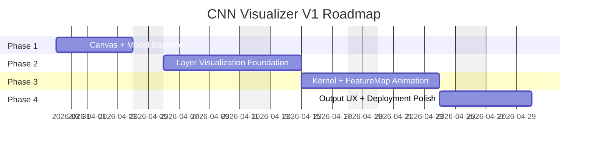

# CNN Visualizer - Implementation Roadmap

## 1. Roadmap Goal

This roadmap defines the execution plan for delivering CNN Visualizer V1 from baseline setup to production deployment.

The plan is organized into sequential phases with explicit deliverables, dependencies, and exit criteria to reduce integration risk.

## 2. Delivery Principles

1. Deliver functional vertical slices early (drawing -> inference -> output).
2. Keep architecture modular from day one to avoid costly refactors.
3. Validate runtime correctness before visual polish.
4. Protect performance and memory safety throughout implementation.
5. Keep deployment pipeline operational before final feature freeze.

## 3. Phase Plan

## Phase 1 - Canvas + Model Baseline (3-5 days)

### Objectives

- Enable freehand digit drawing.
- Convert drawing into model-ready `28x28` input.
- Load MNIST TensorFlow.js model.
- Produce first prediction output.

### Scope

- `DrawCanvas` input handling (mouse + touch).
- Downsample/normalize pipeline.
- `tf.loadLayersModel('/model/model.json')`.
- Console/UI display of top prediction.
- `28x28` input grid preview.

### Exit Criteria

1. User can draw and clear canvas reliably.
2. Preprocessing outputs deterministic `28x28` values.
3. Model loads from static assets without runtime errors.
4. Inference returns valid class distribution for digits `0-9`.

## Phase 2 - Layer Visualization Foundation (1 week)

### Objectives

- Build layer-level visual representation of activations.
- Synchronize model outputs with scene rendering.
- Provide explanatory UI for each stage.

### Scope

- Three.js scene setup and camera flow.
- `LayerRenderer` for activation planes/blocks.
- Activation value-to-color mapping.
- `StepPanel` with layer name + description.
- Initial orchestrator timeline.

### Exit Criteria

1. Activations from each relevant layer render in correct order.
2. Step transitions are deterministic and repeatable.
3. Layer labels and explanations align with rendered stage.

## Phase 3 - Kernel + Feature Map Animation (1 week)

### Objectives

- Visualize convolution traversal mechanics.
- Show progressive feature-map construction.
- Introduce manual vs automatic playback controls.

### Scope

- `KernelAnim` frame-by-frame kernel sweep.
- `FeatureMap` incremental build animation.
- Playback modes: `step` and `auto`.
- Speed control slider.
- GLSL-based activation glow enhancement.

### Exit Criteria

1. Kernel path is spatially accurate relative to input grid.
2. Feature-map build timing matches convolution progression.
3. Playback controls remain synchronized with state machine.

## Phase 4 - Output UX + Product Polish (3-4 days)

### Objectives

- Finalize prediction UI and visual consistency.
- Ensure responsive behavior across device classes.
- Complete deployment and release readiness.

### Scope

- `OutputBar` confidence bars for classes `0-9`.
- Winner highlight pulse effect.
- Responsive layout adjustments.
- Theme/typographic polish.
- GitHub Actions deployment to GitHub Pages.

### Exit Criteria

1. Prediction UI is accurate and stable under repeated input.
2. Mobile and desktop layouts are both usable.
3. Production build deploys automatically from default branch.
4. End-to-end acceptance checklist passes.

## 4. Timeline Visualization

## 5. Dependency Graph

1. Phase 2 depends on stable outputs from Phase 1 (`input tensor`, `activations`).
2. Phase 3 depends on Phase 2 scene abstraction and timeline hooks.
3. Phase 4 depends on Phase 1-3 runtime correctness.
4. CI/CD setup can start in parallel but must be validated before phase closure.

## 6. Workstream Breakdown

### ML Workstream

- Model asset management.
- Inference and activation extraction.
- Tensor lifecycle safety.

### Visualization Workstream

- Three.js scene composition.
- Activation rendering and color mapping.
- Kernel and feature-map animations.

### UI Workstream

- Draw controls, mode toggles, speed control.
- Step panel explanations.
- Output confidence interface.

### DevOps Workstream

- Vite production config.
- GitHub Actions workflow.
- GitHub Pages publish configuration.

## 7. Milestones

1. M1 - First valid inference on drawn input.
2. M2 - Full layer progression visible in 3D.
3. M3 - Kernel traversal + feature map animation complete.
4. M4 - CI deploy + responsive UI + acceptance pass.

## 8. Definition of Done per Phase

Each phase is complete only when:

1. Functional scope is implemented.
2. Regression checks for prior phases pass.
3. Performance remains within target interactive latency.
4. Documentation updates reflect final behavior.

## 9. Risk Register and Mitigation

- Risk: Preprocess mismatch with model expectation.
  - Mitigation: golden-input tests with fixed expected predictions.
- Risk: Tensor memory leak during repeated runs.
  - Mitigation: mandatory `tf.tidy()` and periodic memory checks.
- Risk: Animation/ML desynchronization.
  - Mitigation: single orchestrator timeline authority.
- Risk: Static asset path errors on GitHub Pages.
  - Mitigation: environment-aware base path and CI smoke check.
- Risk: Mobile GPU limitations.
  - Mitigation: adaptive rendering quality and reduced geometry density.

## 10. Parallelization Opportunities

1. UI shell and output components can be built while ML baseline is finalized.
2. CI workflow scaffolding can run in parallel with visualization work.
3. Step panel content authoring can proceed while kernel animation is implemented.

## 11. Completion Gate for V1 Release

Release candidate is approved when:

1. All phase exit criteria are satisfied.
2. Testing and acceptance criteria document is fully green.
3. Production deployment from default branch is validated.
4. No unresolved P0/P1 defects remain.

